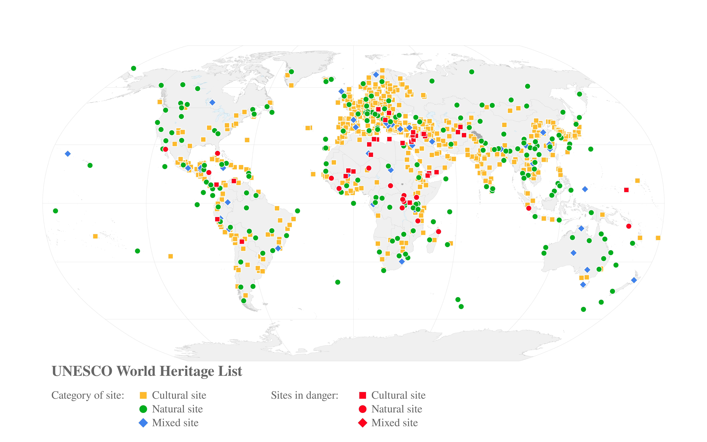

# IPBES Sustainable Use Assessment - Figure Chap3 World Heritage List

This repository contains the code to reproduce the Figure 'World Heritage List' of 
the chapter 3 of the **IPBES Sustainable Use Assessment**. This figure shows the 
global distribution of UNESCO World Heritage sites (both cultural and natural)
with an emphasis on their endangered status.

## System Requirements

This project handles spatial objects with the R package
[`sf`](https://cran.r-project.org/web/packages/sf/index.html). This
package requires some system dependencies (GDAL, PROJ and GEOS). Please
visit [this page](https://github.com/r-spatial/sf/#installing) to
correctly install these tools.

## Usage

First clone this repository, then open the R script `make.R` and run it.
This script will read data stored in the folder `data/` and export the figure
in the folder `figures/`.

## Copyright notice

All material on this page is placed under: 
Copyright © 1992 - 2022 UNESCO/World Heritage Centre. All rights reserved.

